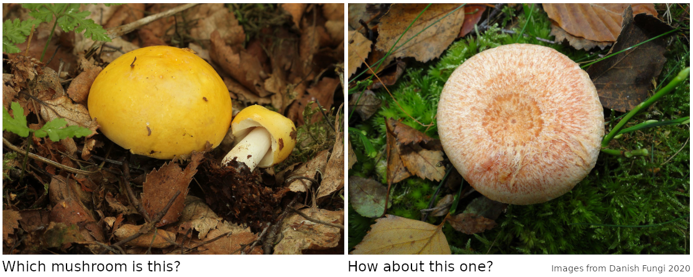
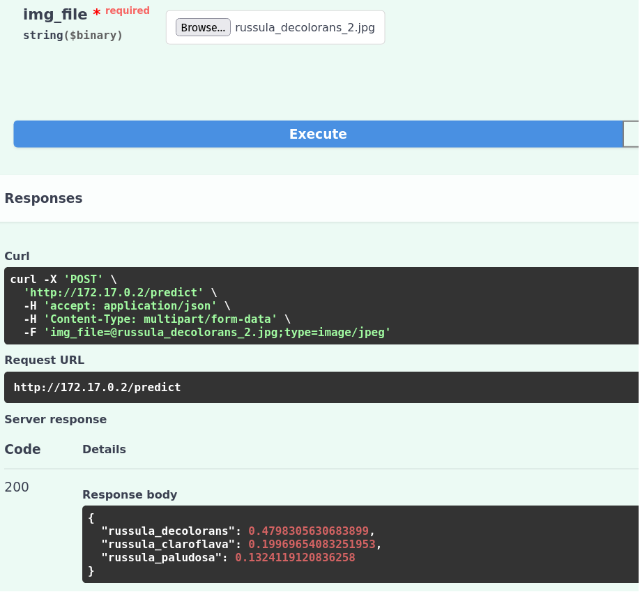

# Mushi-identifier

## Contents

[1 Introduction](#1-introduction)  
[2 Motivation](#2-motivation)  
[3 Installation](#3-installation)  
[4 Project structure](#4-project-structure)  
[5 Technical details](#5-technical-details)  
[6 Roadmap](#6-roadmap)


## 1 Introduction



<br/>

Should you pick either of them?

Have you ever wandered around in the beautiful autumn forest looking for fungi food, but ended up spending most of your time staring at a book while getting inhabited by deer flies. If so, this tool might be just for you! It will help you deduce which mushroom is delicious and which kills you, while allowing you to spend more time marvelling the nature around you.

Mushi-identifier is an image-recognition application (web & mobile) that identifies mushroom species from photos submitted by the user. After receiving a photo, the app runs it through a convolutional neural network (CNN) and returns the names and confidence scores of the top three mushrooms that most closely resemble the species in the image.

Mushi-identifier's predictions should always be verified with a recent mushroom book. The core idea of the app is to allow the user to quickly find the spotted mushroom in the book's glossary - instead of browsing through endless pages looking for images of the species, they can simply check the app's three predictions in the order of confidence. 

The app is targeted at novice mushroom hunters, and for now it seeks to identify the 26 edible mushrooms species recommended by the [Finnish food authority](https://www.ruokavirasto.fi/henkiloasiakkaat/tietoa-elintarvikkeista/elintarvikeryhmat/ruokasienet/suositeltavat-ruokasienet/). These species are common and easy to verify with a book even for beginners.

*Note: Mushi-identifier is a work-in-progress. Currently, a baseline model has been trained with the raw dataset (21/26 species) and deployed as a REST API with Docker and FastAPI, and will soon be made public on a server. Check the [Roadmap](#6-roadmap) below for an overview of the development stage.*

## 2 Motivation

In the autumn of 2021, I did a bunch of mushroom hunting trips with friends who were totally new to the sport. While we usually managed to get home with a decent catch, due to our combined curiosity we spend most of our time in the forest flipping through the pages of various mushroom books. The trips were still fun and great for learning, but because I prefer staring at living trees and colorful nature, I felt like finding a way to make the mushi identifying more practical.

By this time I had already been studying neural networks for over a year, so I figured I could solve the problem in a computer vision project. I started with a review of existing mushroom identifier mobile apps. Some of the apps I found identified mushrooms as edible/non-edible which I found quite detrimental to learning and dangerous - identifying mushrooms involves feeling, peeling, cutting and smelling. Others looked very promising with inbuilt descriptions but they were closed-source with ads and in-app purchases. Consequently, I felt like starting an open-source project that would be useful for me and maybe, in the distant future, also for other enthusiastic mushroom pickers.

I wanted to build an app that would make mushroom books more convenient to use. Ideally, the app would help beginners get into mushroom picking, and its ultimate goal would be to become obsolete to the users - once they learned to fully rely on a book and their experience. I decided to focus and tune the application on species common in Finnish conditions and have it return multiple suggestions for each photo to improve its utility. 

Overall, I felt excited to start a project that could be both a fun learning exercise and practical. And so, mushi-identifier was born.

## 3 Installation

Here are the steps for installing mushi-identifier. You can either download the entire project or just the web application.

1. Clone (or download) this repository:

```bash
git clone https://github.com/jpusa/mushi-identifier.git
```


### Entire project

2. Follow [these instructions](https://python-poetry.org/docs/) to install the dependency management tool Poetry.

3. Install the project dependencies and open a virtual environment with:

```bash
cd mushi-identifier
poetry install
poetry shell
```

4. Download the full [Danish Fungi 2020 dataset](https://sites.google.com/view/danish-fungi-dataset) and extract it to ```data/00_raw/``` (warning: it is big).
5. Run Python scripts to setup the *interim* and *processed* data directories:

```bash
# Run from project root directory
cd mushi-identifier
python3 src/data/s01_make_interim.py
python3 src/data/s02_make_processed.py
```

6. Start training and tuning the model with the notebooks in ```notebooks/``` or the scripts under ```src/model/```. For example:

```bash
# Launch notebook for training the baseline model
jupyter-lab notebooks/01-jp-mushi-identifier-v1.ipynb
```

### Web app

2. Follow [there instructions](https://docs.docker.com/get-docker/) to install Docker.

3. Build and start the Docker container:
```bash
cd mushi-identifier/app
# Build
docker build -t mushi-identifier-app .
# Start (the --rm flag is optional, but helpful for testing)
docker run -d -p 8000:8000 --name mia --rm mushi-identifier-app
```
4. Verify the local IP address of the container, if needed:
```bash
docker inspect mia
# E.g. "IPAddress": "172.17.0.2"
```

Now you are able to request predictions from the model at "IPAddress/predict" (e.g. ```172.17.0.2/predict```). If you want to test the API on a web browser, follow these steps:

5. Connect to the docs page (e.g.```172.17.0.2/docs```) on your browser to access the Swagger UI.

6. Upload an image to receive a raw prediction ("/predict" -> "Try it out" -> "Browse..." -> "Execute"). For example:



## 4 Project structure

The project structure is loosely based on the [Cookiecutter data science](https://drivendata.github.io/cookiecutter-data-science/) template.

```bash
├── data
│   ├── 00_external        # Web-scraped images to supplement raw data, mushroom classes
│   ├── 00_raw             # Danish Fungi 2020 dataset: images and metadata
│   ├── 01_interim         # Non-corrupted species-wise data combined from external & raw
│   └── 02_processed       # Model-ready data split into train/validation/test from interim
├── docs
│   └── images             # Images for this README
├── models                 # Saved models and training logs
├── notebooks              # Jupyter notebooks (EDA, model building)
└── src
    ├── data               # Python code for data manipulation (scraping, shaping, loading)
    └── model              # Python code for model training and predictions
```

## 5 Technical details

### Data

I am using the [Danish Fungi 2020](https://arxiv.org/abs/2103.10107) (preprint paper) as the base dataset. The dataset contains images for 21 out of the 26 mushroom classes. It is overall of high quality, but the classes are quite imbalanced. See the EDA at ```notebooks/00-jp-eda-raw-data.ipynb``` for more details and a walkthrough of the data.

During my initial review, I also found the smaller  [2018 FGVCx Fungi Classification Challenge](https://github.com/visipedia/fgvcx_fungi_comp#data) dataset and the [iNaturalist](https://github.com/visipedia/inat_comp/tree/master/2017#Data) dataset. In the future, I'll consider using these datasets to supplement the classes that are missing / have a low image count in the base dataset. Furthermore, I might scrape websites such as [iNaturalist](https://www.inaturalist.org/), [Danmarks Svampeatlas](https://svampe.databasen.org/), [Luontoportti](https://luontoportti.com/) and [GBIF](https://www.gbif.org/).


### Model

Mushi-identifier is based on a convolutional neural network (CNN). The image recognition task is defined as single-label multiclass classification, since the user is expected to submit only one mushroom species in each image. Due to a shortage of data, I'm training the first (baseline) model with transfer learning with feature extraction. If it seems like there is enough data, I will switch to fine-tuning to improve the performance.

The base network is [MobileNetV2](https://arxiv.org/abs/1801.04381) pre-trained with ImageNet. I chose MobileNet, since it runs well on mobile devices, which are the target deployment platform. Furthermore, it is fast to train - I currently don't have any computing servers at my disposal so I am working with Google Colab GPUs.

See the notebook at ```notebooks/01-jp-mushi-identifier-v1.ipynb``` (TODO: and future model notebooks) for model building details such as metrics, cost, callbacks and hyperparameters.

### Deployment

I will deploy mushi-identifier as a mobile app, that does not require internet connection, since forests and other mushroom regions tend to be low connectivity environments. Additionally, I'll build a REST API with Docker and FastAPI and publish it on a web server to allow calling the model from other devices.

By default, the app returns the top three predictions with confidence scores to the user. This should improve its the overall "accuracy" and utility, since identifying mushrooms is quite a fine-grained and challenging task.

I have chosen to use [Poetry](https://python-poetry.org/) as the packaging / dependency manager since it is well-documented, modern and follows the standard set by [PEP-517](https://www.python.org/dev/peps/pep-0517/).


## 6 Roadmap

This roadmap provides a quick overview of the project development stage. The roadmap will be updated as the project progresses.

_About this: Since this project is at a very early stage, and I'm the only developer, I just put the roadmap here where it's easy to see. If the project ever gets more developers, I might start using a project management environment that links the roadmap to issues/commits._

### Data

**Base steps**
- [x] Review literature and find a solid raw (base) dataset
- [x] Do EDA on the raw dataset
- [x] Verify non-corruption and transfer *raw* data to *interim*
- [x] Split (train/validation/test) and transfer *interim* data to *processed*
- [x] Import *processed* data to tensorflow and start developing the model

**Additional steps**

- [ ] Write a convenience script for loading and extracting the raw dataset and preparing the interim and processed folders. Add a MD5/SHA sum check to the loading part.
- [ ] Investigate the 80,000 "extra" images present in the raw dataset
- [ ] Scrape *external* data from [iNaturalist](https://www.inaturalist.org/), [Danmarks Svampeatlas](https://svampe.databasen.org/), [Luontoportti](https://luontoportti.com/) and/or [GBIF](https://www.gbif.org/).
  - [ ] Scrape data for mushroom species missing from the raw dataset (Albatrellus ovinus, Hygrophorus camarophyllus, Morchella spp., Russula vinosa, Tricholoma matsutake)
  - [ ] Scrape additional data for species with a low image count in the raw dataset
- [ ] Do EDA on the scraped external datasets
- [ ] Verify and add *external* data to *interim* mixing it with the raw data, and split and transfer the mixed *interim* data to *processed*
- [ ] Use the supplemented *processed* data to improve the model

### Model

**Base steps**

- [x] Review literature and make initial modelling choices (architecture, metrics, baseline performance, hyperparameters)
- [x] Build, train and save a baseline model
- [x] Write functions for plotting and prediction
- [ ] Implement k-fold cross-validation to increase reliability of validation metrics and to allow hyperparameter tuning without overfitting validation data
- [ ] Tune hyperparameters
- [ ] Build, train and save an improved model

**Additional steps**
 
- [ ] Add macro-averaged F1 score to metrics, since it should work well for long-tailed distributions
- [ ] Try MobileNetV3 as the base model
- [ ] Try fine-tuning instead of feature extraction, once there is enough data

### Deployment

**Base steps**

- [x] Web app: Implement a simple REST API with Docker and FastAPI
- [ ] Web app: Study security best practices and make the API public on a VPS. (Alternatively: deploy on Heroku or similar platform)
- [ ] Mobile app: Optimize model for mobile - do weight pruning and quantization, convert to Tensorflow lite
- [ ] Mobile app: Wrap the model in an app and deploy on mobile

**Additional steps**

- [ ] Web app: Implement a simple frontend for the web API, so it is easy to use with a browser.
