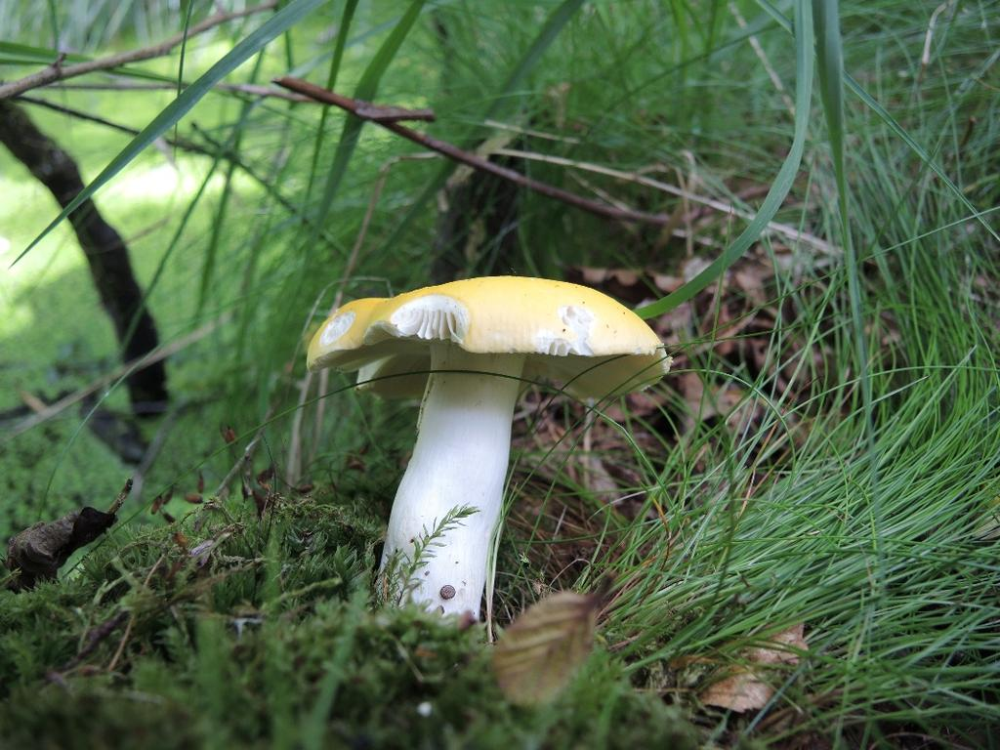
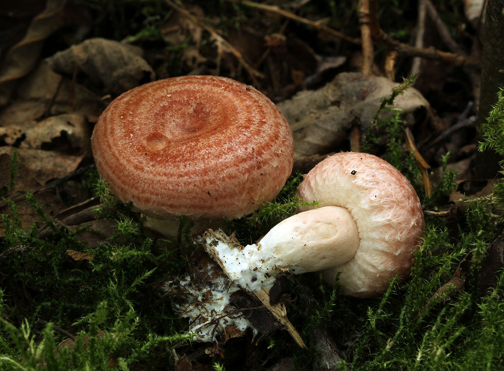

# Mushi identifier

   * [Introduction](#introduction)
   * [Motivation](#motivation)
   * [Installation](#installation)
   * [Technical details](#technical-details)
   * [Project structure](#project-structure)
   * [Roadmap](#roadmap)


## Introduction

<table><tr>
<td> 
  <p align="center" style="padding: 10px">
    <p>Which mushroom is this?</p>
    
  </p> 
</td>
<td> 
  <p align="center">
    <p>How about this one?</p>
    
  </p> 
</td>
</tr></table>

Can you eat either of them? TODO: Make mushroom images and titles a single image in GIMP

<br>

Have you ever wandered around in the beautiful autumn forest looking for fungi food, but ended up spending most of your time staring at a book while getting inhabited by deer flies. If so, this tool might be just for you! It will help you deduce which mushroom is delicious and which kills you, while allowing you to spend more time marvelling the nature around you.

Mushi-identifier is a smartphone app that recognizes mushroom species from photos. After receiving a photo, it returns the name of the mushroom with a confidence score.

The app should be used together with a recent mushroom book. If you find a mushroom you do not know, take a photo for the app and it will tell you what it looks like. Then, you can quickly find the mushroom in the book glossary instead of scrolling through endless pages looking for images of it.

The app is targeted at novice mushroom hunters, and for now it only seeks to identify the edible mushrooms recommended by the [Finnish food authority](https://www.ruokavirasto.fi/henkiloasiakkaat/tietoa-elintarvikkeista/elintarvikeryhmat/ruokasienet/suositeltavat-ruokasienet/). These species are common and easy to verify with a book even for beginners.

*NOTE: This project is a work-in-progress. Check the [Roadmap](#roadmap) below for a quick* overview of the development stage.

## Motivation

This is an autumn deep learning project, that I felt inspired to start after going mushroom hunting with friends with no prior experience in mushrooms. I found that especially for people with less experience, the majority of the time in the forest is spent staring at a book trying to find images that resemble the mushroom in front of you.

During my initial survey I found plenty of deep learning projects that attempt to classify mushrooms as edible vs. non-edible. For me this is nonsensical.

For me it's nonsensical to build an app that simply tells if a mushi is edible or not. This does not support learning, makes every wrong prediction potentially fatal. However, I have many times been in a situation where I spend most of my mushroom hunting time scrolling through the pages of a book looking for any look-likes. This is the problem this project seeks to alleviate, by doing it for you. Then you can check in the glossary and find it quicker.

This can make to help you identify mushrooms, especially if you really have no idea what you might be looking for. So it makes it quicker to find an unknown species in a book.

What makes this special is that it focuses on common species in Finland. Furthermore, the base training dataset is fresh and robust.

*Write some existing apps here. This is a project focusing on Finnish mushrooms. This is a practice project.*

#### Disclaimer

Mushroom identification techniques include feeling, peeling, cutting and smelling the fungi. Furthermore, the habitat, nearby tree species and the time of the year also affect the identification. Features like these are difficult or impossible to teach to an image recognition software.

Therefore, please don't blindly trust any image recognition application for classifying mushrooms. Apps such as mushi-identifier can be helpful, but they cannot replace an experienced friend and/or a recent mushroom book. Even a well-trained model will sometimes make false predictions.

That being said, as long as you use the mushi-identifier together with some scepticism and a good mushroom book, it should save you a lot of time and make your fungi trips fun and pleasant.

## Installation

Docker blabla

## Technical details

### Data

I am using the [Danish Fungi 2020 dataset](https://arxiv.org/abs/2103.10107) (preprint paper). Very neat, but unbalanced / long-tailed. Good, more realistic dataset, since uniformly distributed data is a rarity anyway.

I started the project with another Danish dataset and were planning to complement it with scraped data. However, now this is set as external data and used to add images to missing classes. [iNaturalist](https://github.com/visipedia/inat_comp/tree/master/2017#Data) dataset.

### Model

Mushi-identifier is built on a convolutional neural network. The image recognition task is defined as single-label multi-class classification, since the user is expected to submit only one mushroom species in each image.

Due to a shortage of data, I am using transfer learning with fine-tuning. The base CNN is mobilenet, taught with ImageNet. MobileNet is light enough to run on mobile devices, which are target deployment surface. ImageNet already has elementary mushroom knowledge, which helps with the task.

### Deployment

The deployment is done as a mobile app, since mushroom places tend to be low connectivity environments. However, a REST api + Flask version will also be developed and deployed on a web server as a practice exercise.

The packaging / dependency manager is [Poetry](https://python-poetry.org/), since it is modern and practical and follows the build system standard set by [PEP-517](https://www.python.org/dev/peps/pep-0517/).

## Project structure

```bash
├── data
│   ├── 00_external        # Web-scraped images, mushroom classes
│   ├── 00_raw             # Danish Fungi 2020 dataset: images and metadata
│   ├── 01_interim         # Non-corrupted species-wise data combined from external & raw
│   └── 02_processed       # Model-ready data split into train/validation/test from interim
├── docs
│   └── images             # Images for this README
├── models                 # Saved models
├── notebooks              # Jupyter notebooks (EDA, model presentation)
└── src
    ├── data               # Python code for data manipulation (scraping, cleaning, loading)
    └── model              # Python code for model training and predictions
```

## Roadmap

This simple roadmap provides a quick overview of the project development stage. To keep it light, I have brushed out most detail adding only the major steps. The roadmap will evolve as new ideas come up.

(I could write this in GitHub Projects, but I find them clunky, hard to read and generally overkill for this project. For a larger project with multiple developers I would use a proper project management environment.)

### Data

**Base steps**
- [x] Review literature and find a solid raw (base) dataset
- [x] Do an EDA on the raw dataset
- [x] Verify non-corruption and transfer *raw* data to *interim*
- [x] Split (train/validation/test) and transfer *interim* data to *processed*
- [x] Import *processed* data to tensorflow and start developing model

**Additional steps**

- [ ] Create a script for loading raw data with tf.keras.utils.get_file (add a md5sum check)
- [ ] Scrape *external* data from [iNaturalist](https://www.inaturalist.org/), [Danmarks Svampeatlas](https://svampe.databasen.org/), [Luontoportti](https://luontoportti.com/) and/or [GBIF](https://www.gbif.org/).
  - [ ] Scrape data for mushroom species missing from raw dataset
      - [ ] Albatrellus ovinus (*lampaankääpä*)
      - [ ] Hygrophorus camarophyllus (*mustavahakas*)
      - [ ] Morchella spp. (*huhtasienet*, many variants)
      - [ ] Russula vinosa (*viinihapero*)
      - [ ] Tricholoma matsutake (*tuoksuvalmuska*)
  - [ ] Scrape additional data for species with a low image count in the raw dataset
- [ ] Do EDA on the scraped external datasets
- [ ] Verify and transfer *external* data to *interim* mixing it with the raw data
- [ ] Split (train/validation/test) and transfer mixed *interim* data to *processed*
- [ ] Import *processed* data to tensorflow and use it to improve the model


### Model

**Base steps**

- [ ] Review literature and make initial modelling choices:
  - [ ] Architecture
  - [ ] Metrics
  - [ ] Baseline performance
  - [ ] Hyperparameters  
  * Read this [paper](https://openaccess.thecvf.com/content_WACV_2020/papers/Sulc_Fungi_Recognition_A_Practical_Use_Case_WACV_2020_paper.pdf) 
- [ ] Build an initial model
- [ ] Tune hyperparameters
- [ ] Build, train and save a better model

**Additional steps**
 
- [ ] Implement k-fold cross validation instead of standard data split to increase the reliability of validation scores.
- [ ] Consider iterated k-fold with shuffling, if enough computational resources. If we do hyperparameter tuning, this might be needed in any case to not overfit to the validation data.
- [ ] Consider adding macro-averaged F1 score to metrics (by subclassing), since it works well for long-tailed class distributions [Fungi paper].
- [ ] Based on the model prediction, present yes/no-questions to the user ("If you cut the bottom, does it bleed white? y/n") to verify the species.

### Deployment

**Base steps**

- [ ] Prepare a Dockerfile so that the project can be easily transferred to other systems
- [ ] Do weight pruning and quantization to optimize the model
- [ ] Transfer the model into a Tensorflow lite model
- [ ] Develop the mobile application and deploy it on a smartphone

**Additional steps**

- [ ] Create a simple web application with Flask + REST api
- [ ] Study cybersecurity best practices and reveal the web app to the internet
